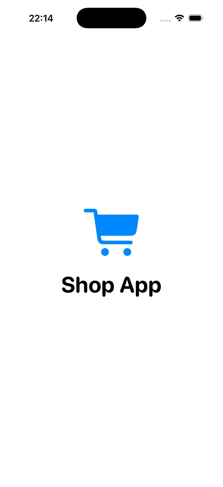
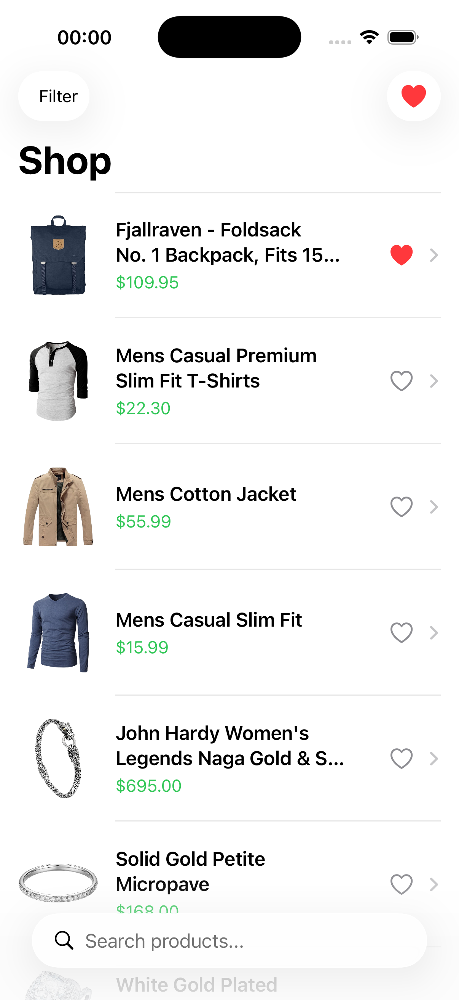
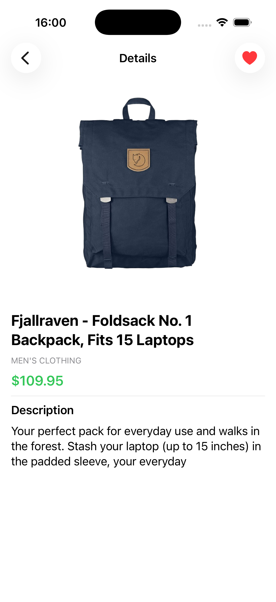
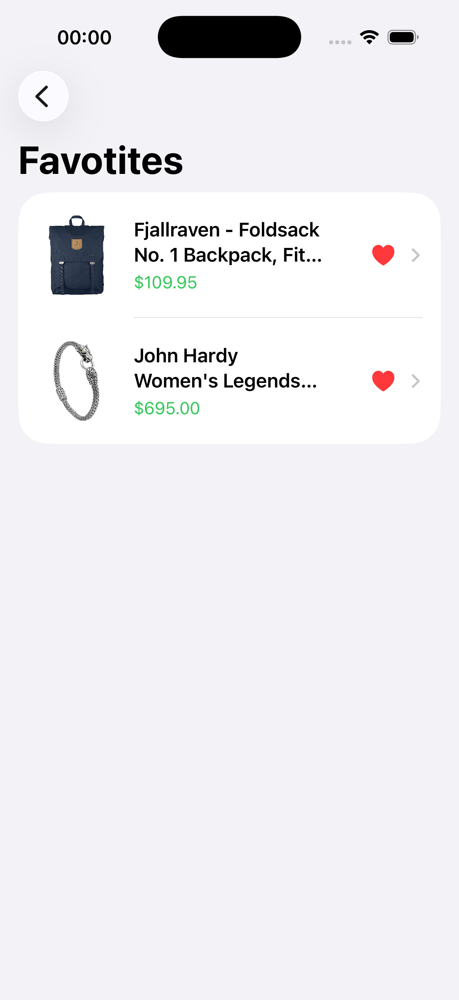

# 🛍 Product Listing App  
📱 SwiftUI + Combine Product App with Pagination

A modern iOS application built using **SwiftUI** and **Combine**, demonstrating reactive state management, pagination, search, filtering, and local persistence using a clean **MVVM + Repository architecture**.

The app focuses on scalability, separation of concerns, reusable networking, and real-world production practices.

---

## ✨ Features

- Splash Screen with automatic navigation  
- Product List Screen with API integration  
- Infinite scrolling (pagination)  
- Pull-to-refresh support  
- Real-time product search  
- Category & price filtering  
- Product Detail Screen  
- Favorites system with local persistence  
- Reactive UI updates using Combine  
- Clean architecture (MVVM + Repository)  
- Dependency Injection  

---

## 🖼 Screenshots

 
 
 
 
 

---

## 🔄 App Flow

### 🚀 App Launch
- App starts with Splash Screen  
- Automatically navigates to Product List Screen  

---

## 🏠 Product List Screen

### UI Components
- App title / header  
- Search bar  
- Category filter dropdown  
- Scrollable product list  
- Favorite button on each item  

### Each Product Item Includes
- Product image  
- Product name  
- Price  
- Favorite toggle button  

### UI Behavior
- Products are fetched from API  
- Infinite scrolling loads next page automatically  
- Pull-to-refresh reloads products  
- Search updates results in real-time  
- Filters update list reactively  
- Favorite state updates instantly  

---

## 🔍 Search & Filtering

### Search
- Filters products by name  
- Updates list as user types (Combine-powered)  

### Filters
- Category filter  
- Optional price filtering  
- Fully reactive updates  

---

## 📦 Product Detail Screen

### UI Components
- Product image  
- Name  
- Description  
- Price  
- Favorite button  

### Behavior
- Displays selected product details  
- Allows adding/removing from favorites  
- Back navigation to list  

---

## ❤️ Favorites

- Users can mark/unmark products as favorites  
- Favorites are stored locally using **SwiftData / CoreData**  
- Persist across app restarts  
- UI updates instantly when toggled  

---

## 🧠 Architecture & Approach

### View
- Renders UI  
- Subscribes to ViewModel using Combine  
- Contains no business logic  

### ViewModel
- Manages state using Combine  
- Handles:
  - API response state  
  - Pagination logic  
  - Search & filter updates  
- Communicates only with Repository  

### Repository
- Single source of truth  
- Handles:
  - API requests  
  - Local persistence (favorites)  
- Injected into ViewModel  

---

## 🌐 Networking
Can be implemented using:
- URLSession
- Alamofire

## 🔄 Pagination
- Implemented using infinite scroll  
- Loads next page when user reaches bottom  
- Fake Store API is sliced on client side to simulate pagination  

## 💾 Data Persistence
- Favorites stored locally using SwiftData / CoreData  
- Persist across launches  
- Updates reflected instantly in UI  

## 🚨 Error Handling & States

### Error Scenarios
- Network failure → “No internet connection”  
- API failure → “Something went wrong”  
- Empty results → “No products found”  

### UI States
- Loading → Progress indicator  
- Success → Display products  
- Failure → Show error message  

## 🚫 Restrictions Followed
- ❌ No Combine logic inside Views  
- ❌ No direct API calls in ViewModel  
- ❌ No tight coupling between layers  
- ❌ No force unwraps  
- ❌ MVVM + Repository strictly followed  

## 🛠 Tech Stack
- Swift  
- SwiftUI  
- Combine  
- MVVM Architecture  
- Repository Pattern  
- SwiftData / CoreData  
- Alamofire / URLSession  
- Fake Store API  

## 🌐 API
Using Fake Store API:

- GET /products → Fetch all products  
- GET /products/:id → Product details  
- GET /products/categories → Categories  

🔗 https://fakestoreapi.com/

## 👩‍💻 Author
**Nadira Seitkazy**  
Junior iOS Developer  
